<!-- PROJECT SHIELDS -->
<a name="readme-top"></a>

[![LinkedIn][linkedin-shield]][linkedin-url]


<!-- PROJECT LOGO -->
<br />
<div align="center">

  <a>
    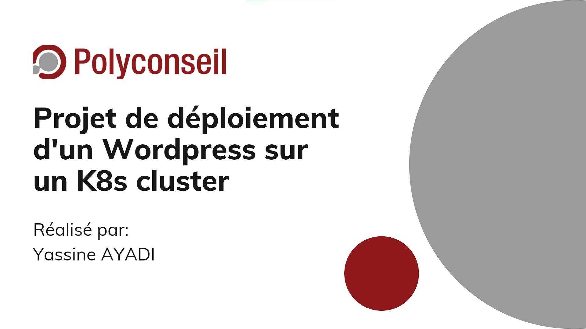
  </a>
  
  <h3 align="center">Déploiement d'un Wordpress sur un K8s cluster</h3>

  <p align="center">
    <a href="https://drive.google.com/file/d/1NWYQm3WMgxJy6v_MiRlwAEI4E5ssOdP9/view?usp=share_link">Voir Demo</a>
    ·
    <a href="https://www.canva.com/design/DAFSUqOr44k/OQdXHrZRbE4srRqs2dX9Jg/edit?utm_content=DAFSUqOr44k&utm_campaign=designshare&utm_medium=link2&utm_source=sharebutton">Voir Présentation</a>
  </p>
</div>


<!-- TABLE DES MATIÈRES -->
<details>
  <summary>TABLE DES MATIÈRES</summary>
  <ol>
    <li>
      <a href="#à_propos">A propos du projet</a>
      <ul>
        <li><a href="#tech">Technologies utilisées</a></li>
      </ul>
    </li>
    <li>
      <a href="#Prérequis">Prérequis</a>
    </li>
    <li><a href="#usage">Etapes à suivre</a></li>
    <li><a href="#Demo">Vidéo demo</a></li>
    <li><a href="#roadmap">Roadmap</a></li>
    <li><a href="#contact">Contact</a></li>
    <li><a href="#liens">Liens utiles</a></li>
  </ol>
</details>


<!-- ABOUT THE PROJECT -->
<a name="à_propos"></a>
## A propos du projet


Ce projet vise à l'automatisation de bout en bout du processus de déploiement d'un Wordpress sur un cluster K8s (Un cluster EKS pour notre cas de figure) tout en abordant les point suivants: 

* Déployer un WordPress sur un cluster Kubernetes. (EKS cluster)
* Packager l'application WordPress avec l'outil Helm.
* Automatiser le provisioning de toute l'infrastructure. (utilisation de Terraform)
* Automatiser le déploiement avec une chaîne de CI/CD. (utilisation de Jenkins)
* Déployer une architecture 'production-ready'.
* Assurer le monitoring du K8s Cluster avec Prometheus et Grafana.


<p align="right">(<a href="#readme-top">back to top</a>)</p>


<a name="tech"></a>
### Technologies utilisées

Les différentes technologies utilisées pour la mise en oeuvre de ce projet sont les suivantes: 

* Kubernetes
* Terraform
* Jenkins
* AWS Cloud provider
* Helm
* Prometheus
* Grafana

<p align="right">(<a href="#readme-top">back to top</a>)</p>


<!-- Prérequis -->
<a name="Prérequis"></a>
## Prérequis

<a name="Prérequis"></a>
* Une inscription AWS
* AWS CLI
* Kubectl
* Terraform CLI
* Helm
* Image docker de Jenkins
* Docker 

<p align="right">(<a href="#readme-top">back to top</a>)</p>


<a name="usage"></a>
## Etapes à suivre


Ce projet a été élaboré en suivant plusieurs phases permettant d'assurer une automatisation de l'intégralité du processus de déploiement du Wordpress sur le cluster EKS. Pour bénéficier de cette automatisation, Veuillez suivre les étapes suivantes:

1. Approvisonnement d'une instance EC2 sur le cloud AWS 

<div align="center">
  <a>
    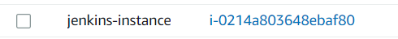
  </a>
</div> 
  
2. Lancer l'image de Jenkins sur l'instance EC2
   ```sh
   docker run --name myjenkins -p 8080:8080 -p 50000:50000 -v /var/jenkins_home jenkins
   ```
   
<div align="center">
  <a>
    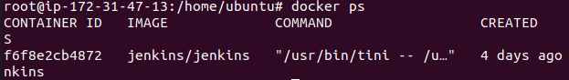
  </a>
</div> 

3. Créer un pipeline sur Jenkins et définir ce répo comme Branch source pour ce pipeline

<div align="center">
  <a>
    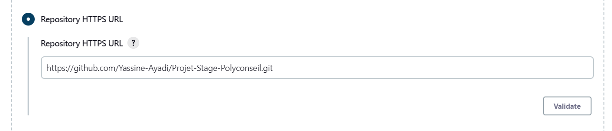
  </a>
</div> 

4. Définir les identifiants "Credentials" du compte AWS sur Jenkins

<div align="center">
  <a>
    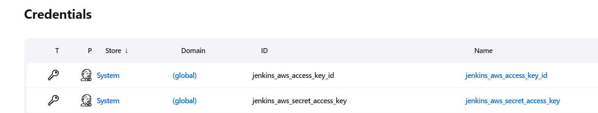
  </a>
</div> 

5. Créer un S3 bucket sur AWS pour le stockage des fichiers d'état de Terraform "Remote State"

<div align="center">
  <a>
    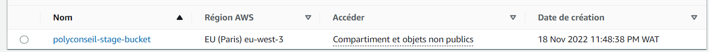
  </a>
</div> 

6. Lancer le build du Pipeline

<div align="center">
  <a>
    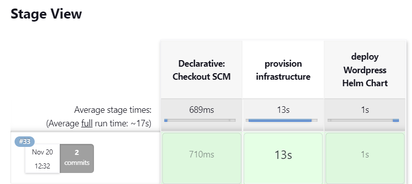
  </a>
</div> 

7. Vérifier la création du cluster EKS

<div align="center">
  <a>
    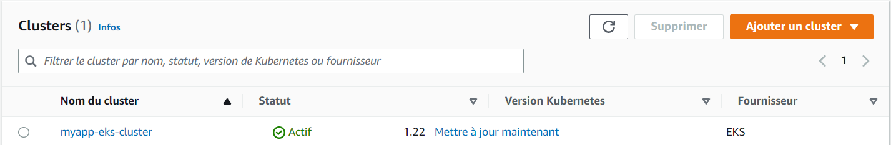
  </a>
</div> 

8. Vérifier la création du VPC

<div align="center">
  <a>
    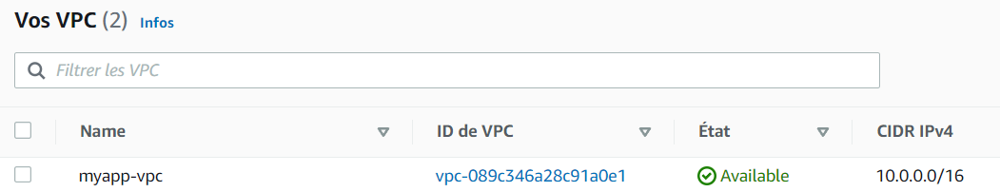
  </a>
</div> 

8. Vérifier la création du LoadBalancer

<div align="center">
  <a>
    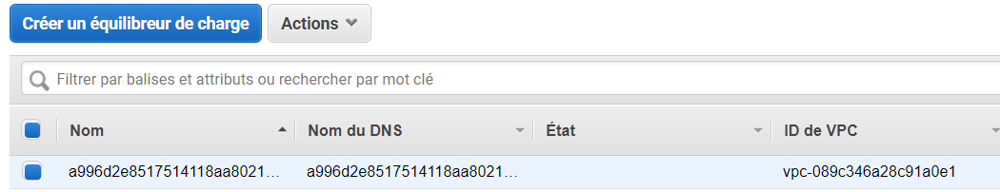
  </a>
</div> 

9. Accès à Wordpress à travers le nom DNS du LoadBalancer

<div align="center">
  <a>
    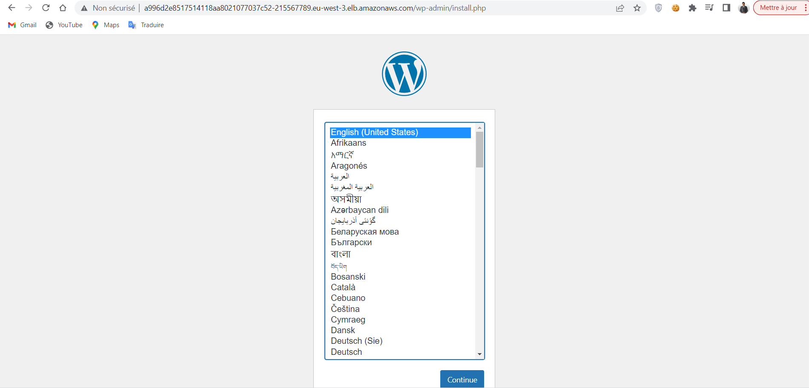
  </a>
</div> 


10. Déploiement de Prometheus et Grafana pour le monitoring du K8s cluster 


   ```sh
  aws eks update-kubeconfig --name myapp-eks-cluster --region eu-west-3
  helm repo add prometheus-community https://prometheus-community.github.io/helm-charts
  helm repo update
  kubectl create namespace monitoring
  helm install monitoring prometheus-community/kube-prometheus-stack -n monitoring
  helm ls

   ```
   
11. Accès à Prometheus UI

   ```sh
kubectl port-forward svc/monitoring-kube-prometheus-prometheus 9090:9090 -n monitoring &
   ```

<div align="center">
  <a>
    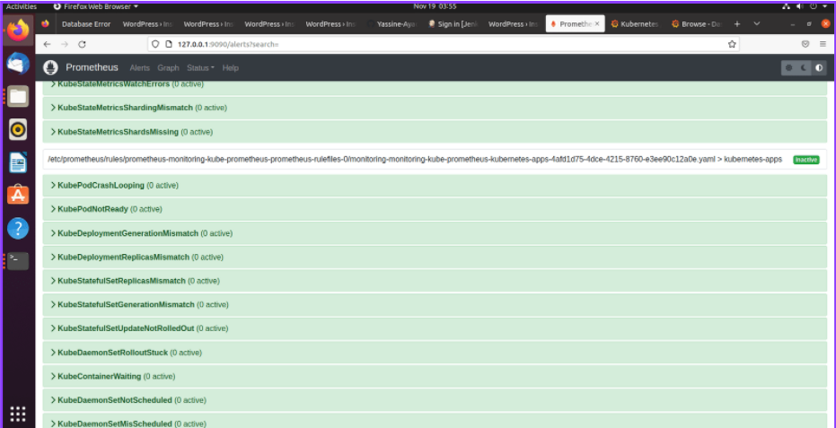
  </a>
</div> 

11. Accès à Grafana

 ```sh  
kubectl port-forward svc/monitoring-grafana 8080:80 -n monitoring &
user: admin
pwd: prom-operator
```


<div align="center">
  <a>
    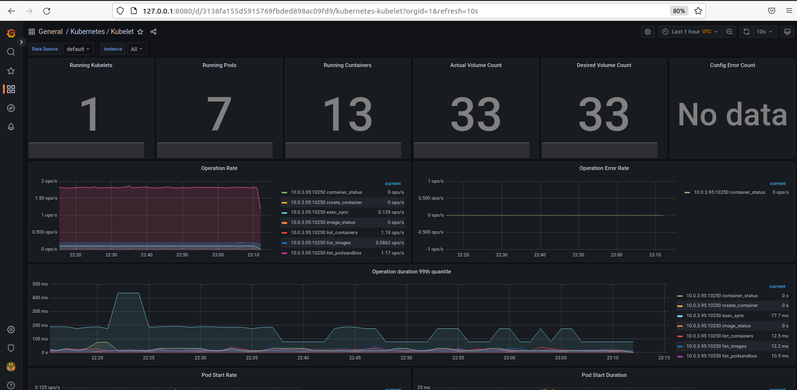
  </a>
</div> 


<p align="right">(<a href="#readme-top">back to top</a>)</p>


<!-- Vidéo démo -->
<a name="Demo"></a>
## Vidéo Démo
Ceci est une partie de la vidéo démo. Pour visualiser l'intégralité de la vidéo cliquez ici: [Intégralité de la vidéo](https://drive.google.com/file/d/1NWYQm3WMgxJy6v_MiRlwAEI4E5ssOdP9/view?usp=share_link)

https://user-images.githubusercontent.com/82244304/202921586-fabb58c2-4f2f-4eae-ba63-9fa1ee89706c.mp4

<p align="right">(<a href="#readme-top">back to top</a>)</p>

<!-- ROADMAP -->
## Roadmap

- [x] Déployer un Wordpress sur un cluster EKS
- [x] Packager l'application avec l'outil Helm
- [x] Automatiser le Provisionning de toute l'infrastructure avec Terraform
- [x] Automatiser le déploiement en implémentant un Pipeline CI/CD
- [x] Assurer le Monitoring à l'aide de Prometheus et Grafana
- [ ] 


<p align="right">(<a href="#readme-top">back to top</a>)</p>


<!-- CONTACT -->
## Contact

Yassine AYADI - [@Linkedin](https://www.linkedin.com/in/yassine-ayadi/) - yassine.ayadi@insat.ucar.tn

Project Link: [https://github.com/Yassine-Ayadi/Projet-Stage-Polyconseil.git](https://github.com/Yassine-Ayadi/Projet-Stage-Polyconseil.git)

<p align="right">(<a href="#readme-top">back to top</a>)</p>


<!-- Liens utiles -->
<a name="liens"></a>
## Liens utiles


Ces liens pourraient être utiles: 

* [Installer Terraform CLI](https://developer.hashicorp.com/terraform/tutorials/aws-get-started/install-cli)
* [Installer AWS CLI](https://docs.aws.amazon.com/cli/latest/userguide/getting-started-install.html)
* [Installer Kubectl](https://kubernetes.io/docs/tasks/tools/)
* [Jenkins docker Image](https://hub.docker.com/r/jenkins/jenkins)
* [Installer Helm](https://helm.sh/docs/intro/install/)
* [Installer Docker](https://www.hostinger.fr/tutoriels/installer-docker-sur-ubuntu)

<p align="right">(<a href="#readme-top">back to top</a>)</p>


[linkedin-url]: https://www.linkedin.com/in/yassine-ayadi-68aa551a0/
[linkedin-shield]: https://img.shields.io/badge/-LinkedIn-black.svg?style=for-the-badge&logo=linkedin&colorB=555
