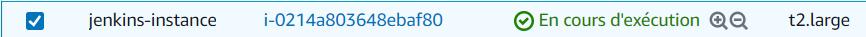

<!-- PROJECT SHIELDS -->
<a name="readme-top"></a>

[![LinkedIn][linkedin-shield]][linkedin-url]


<!-- PROJECT LOGO -->
<br />
<div align="center">

  <a>
    
  </a>
  
  <h3 align="center">Déploiement d'un Wordpress sur un K8s cluster</h3>

  <p align="center">
    <a href="https://drive.google.com/file/d/1NWYQm3WMgxJy6v_MiRlwAEI4E5ssOdP9/view?usp=share_link">Voir Demo</a>
    ·
    <a href="https://www.canva.com/design/DAFSUqOr44k/OQdXHrZRbE4srRqs2dX9Jg/edit?utm_content=DAFSUqOr44k&utm_campaign=designshare&utm_medium=link2&utm_source=sharebutton">Voir Présentation</a>
  </p>
</div>


<!-- TABLE OF CONTENTS -->
<details>
  <summary>Table of Contents</summary>
  <ol>
    <li>
      <a href="#about-the-project">Déploiement d'un Wordpress sur un cluster K8s</a>
      <ul>
        <li><a href="#built-with">Built With</a></li>
      </ul>
    </li>
    <li>
      <a href="#getting-started">Getting Started</a>
      <ul>
        <li><a href="#prerequisites">Prerequisites</a></li>
        <li><a href="#installation">Installation</a></li>
      </ul>
    </li>
    <li><a href="#usage">Usage</a></li>
    <li><a href="#roadmap">Roadmap</a></li>
    <li><a href="#contributing">Contributing</a></li>
    <li><a href="#license">License</a></li>
    <li><a href="#contact">Contact</a></li>
    <li><a href="#acknowledgments">Acknowledgments</a></li>
  </ol>
</details>


<!-- ABOUT THE PROJECT -->
## A propos du projet

Ce projet vise à l'automatisation de bout en bout du processus de déploiement d'un Wordpress sur un cluster K8s (Un cluster EKS pour notre cas de figure) tout en abordant les point suivants: 

* Déployer un WordPress sur un cluster Kubernetes. (EKS cluster)
* Packager l'application WordPress avec l'outil Helm.
* Automatiser le provisioning de toute l'infrastructure. (utilisation de Terraform)
* Automatiser le déploiement avec une chaîne de CI/CD. (utilisation de Jenkins)
* Déployer une architecture 'production-ready'.
* Assurer le monitoring du K8s Cluster avec Prometheus et Grafana.


<p align="right">(<a href="#readme-top">back to top</a>)</p>


### Technologies utilisées

Les différentes technologies utilisées pour la mise en oeuvre de ce projet sont les suivantes: 

* Kubernetes
* Terraform
* Jenkins
* AWS Cloud provider
* Helm
* Prometheus
* Grafana

<p align="right">(<a href="#readme-top">back to top</a>)</p>


<!-- GETTING STARTED -->

## Prérequis

* Une inscription AWS
* AWS CLI
* Kubectl
* Terraform
* Helm
* Image docker de Jenkins
* Docker 


## Etapes à suivre

Ce projet a été élaboré en suivant plusieurs phases permettant d'assurer une automatisation de l'intégralité du processus de déploiement du Wordpress sur le cluster EKS. Pour bénéficier de cette automatisation, Veuillez suivre les étapes suivantes:

1. Approvisonnement d'une instance EC2 sur le cloud AWS 

<div align="center">
  <a>
    
  </a>
</div> 
  
2. Lancer l'image de Jenkins sur l'instance EC2
   ```sh
   docker run --name myjenkins -p 8080:8080 -p 50000:50000 -v /var/jenkins_home jenkins
   ```
   
<div align="center">
  <a>
    
  </a>
</div> 

3. Créer un pipeline sur Jenkins et définir ce répo comme Branch source pour ce pipeline

<div align="center">
  <a>
    
  </a>
</div> 

4. Définir les identifiants "Credentials" du compte AWS sur Jenkins

<div align="center">
  <a>
    
  </a>
</div> 

5. Créer un S3 bucket sur AWS pour le stockage des fichiers d'état de Terraform "Remote State"

<div align="center">
  <a>
    
  </a>
</div> 

6. Lancer le build du Pipeline

<div align="center">
  <a>
    
  </a>
</div> 

7. Vérifier la création du cluster EKS

<div align="center">
  <a>
    
  </a>
</div> 

8. Vérifier la création du VPC

<div align="center">
  <a>
    
  </a>
</div> 

8. Vérifier la création du LoadBalancer

<div align="center">
  <a>
    
  </a>
</div> 

9. Accès à Wordpress à travers le nom DNS du LoadBalancer

<div align="center">
  <a>
    
  </a>
</div> 


10. Déploiement de Prometheus et Grafana pour le monitoring du K8s cluster 


   ```sh
  aws eks update-kubeconfig --name myapp-eks-cluster --region eu-west-3
  helm repo add prometheus-community https://prometheus-community.github.io/helm-charts
  helm repo update
  kubectl create namespace monitoring
  helm install monitoring prometheus-community/kube-prometheus-stack -n monitoring
  helm ls

   ```
   
11. Accès à Prometheus UI

   ```sh
kubectl port-forward svc/monitoring-kube-prometheus-prometheus 9090:9090 -n monitoring &
   ```

<div align="center">
  <a>
    
  </a>
</div> 

11. Accès à Grafana

 ```sh  
kubectl port-forward svc/monitoring-grafana 8080:80 -n monitoring &
user: admin
pwd: prom-operator
```


<div align="center">
  <a>
    
  </a>
</div> 


<p align="right">(<a href="#readme-top">back to top</a>)</p>


<!-- USAGE EXAMPLES -->
## Usage

Use this space to show useful examples of how a project can be used. Additional screenshots, code examples and demos work well in this space. You may also link to more resources.

_For more examples, please refer to the [Documentation](https://example.com)_

<p align="right">(<a href="#readme-top">back to top</a>)</p>


<!-- ROADMAP -->
## Roadmap

- [x] Add Changelog
- [x] Add back to top links
- [ ] Add Additional Templates w/ Examples
- [ ] Add "components" document to easily copy & paste sections of the readme
- [ ] Multi-language Support
    - [ ] Chinese
    - [ ] Spanish

See the [open issues](https://github.com/othneildrew/Best-README-Template/issues) for a full list of proposed features (and known issues).

<p align="right">(<a href="#readme-top">back to top</a>)</p>


<!-- CONTRIBUTING -->
## Contributing

Contributions are what make the open source community such an amazing place to learn, inspire, and create. Any contributions you make are **greatly appreciated**.

If you have a suggestion that would make this better, please fork the repo and create a pull request. You can also simply open an issue with the tag "enhancement".
Don't forget to give the project a star! Thanks again!

1. Fork the Project
2. Create your Feature Branch (`git checkout -b feature/AmazingFeature`)
3. Commit your Changes (`git commit -m 'Add some AmazingFeature'`)
4. Push to the Branch (`git push origin feature/AmazingFeature`)
5. Open a Pull Request

<p align="right">(<a href="#readme-top">back to top</a>)</p>


<!-- LICENSE -->
## License

Distributed under the MIT License. See `LICENSE.txt` for more information.

<p align="right">(<a href="#readme-top">back to top</a>)</p>


<!-- CONTACT -->
## Contact

Your Name - [@your_twitter](https://twitter.com/your_username) - email@example.com

Project Link: [https://github.com/your_username/repo_name](https://github.com/your_username/repo_name)

<p align="right">(<a href="#readme-top">back to top</a>)</p>


<!-- ACKNOWLEDGMENTS -->
## Acknowledgments

Use this space to list resources you find helpful and would like to give credit to. I've included a few of my favorites to kick things off!

* [Choose an Open Source License](https://choosealicense.com)
* [GitHub Emoji Cheat Sheet](https://www.webpagefx.com/tools/emoji-cheat-sheet)
* [Malven's Flexbox Cheatsheet](https://flexbox.malven.co/)
* [Malven's Grid Cheatsheet](https://grid.malven.co/)
* [Img Shields](https://shields.io)
* [GitHub Pages](https://pages.github.com)
* [Font Awesome](https://fontawesome.com)
* [React Icons](https://react-icons.github.io/react-icons/search)

<p align="right">(<a href="#readme-top">back to top</a>)</p>


<!-- MARKDOWN LINKS & IMAGES -->
<!-- https://www.markdownguide.org/basic-syntax/#reference-style-links -->
[contributors-shield]: https://img.shields.io/github/contributors/othneildrew/Best-README-Template.svg?style=for-the-badge
[contributors-url]: https://github.com/othneildrew/Best-README-Template/graphs/contributors
[forks-shield]: https://img.shields.io/github/forks/othneildrew/Best-README-Template.svg?style=for-the-badge
[forks-url]: https://github.com/othneildrew/Best-README-Template/network/members
[stars-shield]: https://img.shields.io/github/stars/othneildrew/Best-README-Template.svg?style=for-the-badge
[stars-url]: https://github.com/othneildrew/Best-README-Template/stargazers
[issues-shield]: https://img.shields.io/github/issues/othneildrew/Best-README-Template.svg?style=for-the-badge
[issues-url]: https://github.com/othneildrew/Best-README-Template/issues
[license-shield]: https://img.shields.io/github/license/othneildrew/Best-README-Template.svg?style=for-the-badge
[license-url]: https://github.com/othneildrew/Best-README-Template/blob/master/LICENSE.txt
[linkedin-shield]: https://img.shields.io/badge/-LinkedIn-black.svg?style=for-the-badge&logo=linkedin&colorB=555
[linkedin-url]: https://www.linkedin.com/in/yassine-ayadi/
[product-screenshot]: images/screenshot.png
[Next.js]: https://img.shields.io/badge/next.js-000000?style=for-the-badge&logo=nextdotjs&logoColor=white
[Next-url]: https://nextjs.org/
[React.js]: https://img.shields.io/badge/React-20232A?style=for-the-badge&logo=react&logoColor=61DAFB
[React-url]: https://reactjs.org/
[Vue.js]: https://img.shields.io/badge/Vue.js-35495E?style=for-the-badge&logo=vuedotjs&logoColor=4FC08D
[Vue-url]: https://vuejs.org/
[Angular.io]: https://img.shields.io/badge/Angular-DD0031?style=for-the-badge&logo=angular&logoColor=white
[Angular-url]: https://angular.io/
[Svelte.dev]: https://img.shields.io/badge/Svelte-4A4A55?style=for-the-badge&logo=svelte&logoColor=FF3E00
[Svelte-url]: https://svelte.dev/
[Laravel.com]: https://img.shields.io/badge/Laravel-FF2D20?style=for-the-badge&logo=laravel&logoColor=white
[Laravel-url]: https://laravel.com
[Bootstrap.com]: https://img.shields.io/badge/Bootstrap-563D7C?style=for-the-badge&logo=bootstrap&logoColor=white
[Bootstrap-url]: https://getbootstrap.com
[JQuery.com]: https://img.shields.io/badge/jQuery-0769AD?style=for-the-badge&logo=jquery&logoColor=white
[JQuery-url]: https://jquery.com 
# Projet-Stage-Polyconseil
